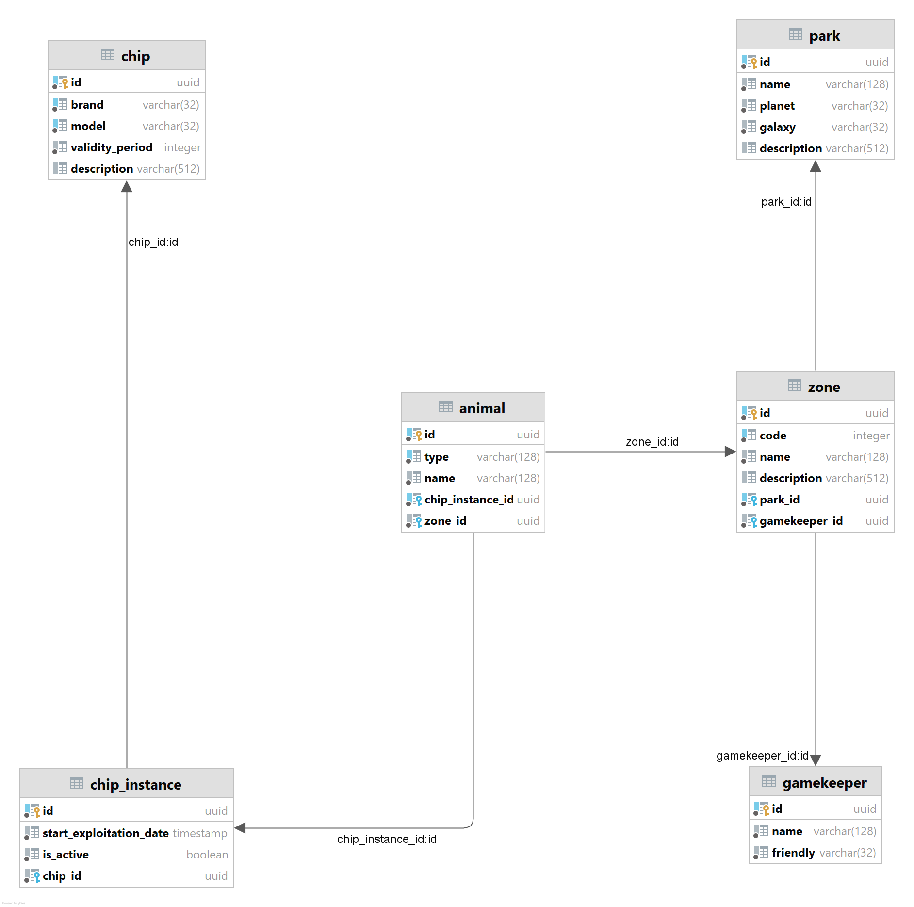

# Реляционные базы данных. Hibernate

## Сценарий

`Заселим в зоопарк нового обитателя Стингбата по кличке «Мотылек»`

Для этого нам потребуется выполнить несколько шагов:
1. Получим тип чипа, который подходит чип для Земли и Пандоры;
```java
        val eva: Chip = chipRepository.findBy(Attribute("brand", "wall&eva"), Attribute("model", "we-213951"))
```
2. Произведем новый чип с типом из пункта (1);
```java
        val newEvaChip = ChipInstance(UUID.randomUUID(), chip = eva)
        newEvaChip.id = chipInstanceRepository.create(newEvaChip)
```
3. Вычислим зону в которой будет обитать Стингбат;
```java
        val waterfall = zoneRepository.findById(UUID.fromString("dd1d13d7-e1cd-4969-a74c-4fee05ab9e07"))
```
4. Поселим животное (присвоив ему зону и экземпляр чипа) в нашем заповеднике;
```java
        val moth: Animal = Animal(
            id = UUID.randomUUID(),
            type = "Стингбат",
            name = "Мотылек",
            chip = newEvaChip,
            areal = waterfall
        )
        val uuid: UUID = animalRepository.create(moth)
```
5. Изменим Стингбату чип на альтернативный (более подходящий), аналогично шагам (1) и (2);
```java
        moth.chip = newIntergalacticChip
        animalRepository.update(moth)
```
6. Выпустим Стингбата на волю.
```java
        animalRepository.deleteById(uuid)
```

В примере нам потребуется **4** сущности из **6**: [Зоны](#Zone), [Животные](#Animal), [Экземпляр чипа](#ChipInstance), [Чип](#Chip).

## Схема «Заповедник»

### Park

Особенности и описание:
* Парки разделены на [Зоны](#Zone).

Замечания:
* Понятно что место нахождения нужно выносить отдельно, но и так много сущностей.

|Название атрибута|Тип атрибута|Описание|
| :---: | :---:| --- |
| **id** | _uuid_ | уникальный идентификатор записи |
| **name** | _string_ | название парка |
| **planet** | _string_ | планета на которой находится парк |
| **galaxy** | _string_ | галактика в которой располагается парк |
| **description** | _string_ | описание особенностей парка |

### Gamekeeper

Особенности и описание:
* Смотритель парка (егерь) наблюдает за [Зонами](#Zone);
* Егерь может наблюдать за несколькими зонами одновременно.

|Название атрибута|Тип атрибута|Описание|
| :---: | :---:| --- |
| **id** | _uuid_ | уникальный идентификатор записи |
| **name** | _string_ | имя смотрителя |
| **friendly** | _string_ | уровень дружелюбности |

### Zone

Особенности и описание:
* Зоны разделяют [Парк](#Park) на части (например по свойствам обитателей);
* За зонами смотрит [Егерь](#Gamekeeper);
* В зонах обитают [Животные](#Animal);
* В парках у зон есть собственный **code**: уникальность зоны определяется по связке идентификатора парка и кода зоны.

|Название атрибута|Тип атрибута|Описание|
| :---: | :---:| --- |
| **id** | _uuid_ | уникальный идентификатор записи |
| **code** | _int_ | код зоны в парке (не уникальный) |
| **name** | _string_ | название зоны |
| **description** | _string_ | описание особенностей зоны |
| **park_id** | _uuid_ | идентификатор парка к которому относится зона |
| **gamekeeper_id** | _uuid_ | привязанный к зоне смотритель |


### Animal 

Особенности и описание:
* Животные обитают в [Зонах](#Zone);
* Зона это основной ареал обитания животного;
* У каждого животного есть [Чип](#ChipInstance);
* Животных можно искать по виду: для данного поля создается индекс.

|Название атрибута|Тип атрибута|Описание|
| :---: | :---:| --- |
| **id** | _uuid_ | уникальный идентификатор записи |
| **type** | _string_ | вид животного |
| **name** | _string_ | имя животного |
| **chip_instance_id** | _uuid_ | идентификатор установленного _типа_ чипа |
| **zone_id** | _uuid_ | идентификатор зона в которой обитает животное |

### Chip

Особенности и описание:
* У чипа есть *brand* и *model*: они образуют уникальную связку.

|Название атрибута|Тип атрибута|Описание|
| :---: | :---:| --- |
| **id** | _uuid_ | уникальный идентификатор записи |
| **brand** | _string_ | название бренда производителя |
| **validity_period** | _integer_ | срок действия данной модели чипа |
| **model** | _string_ | название модели |
| **description** | _string_ | описание особенностей чипа |

### ChipInstance

Особенности и описание:
* [Животных](#Animal) чипируют для отслеживания их состояния;
* Каждый чип уникальны и является экземпляром конкретного [Чипа](#Chip)

|Название атрибута|Тип атрибута|Описание|
| :---: | :---:| --- |
| **id** | _uuid_ | уникальный идентификатор записи |
| **start_exploitation_date** | _timestamp_ | время начала эксплуатации |
| **is_active** | _boolean_ | признак активности |
| **chip_id** | _uuid_ | идентификатор _типа_ чипа |

### Визуализация




